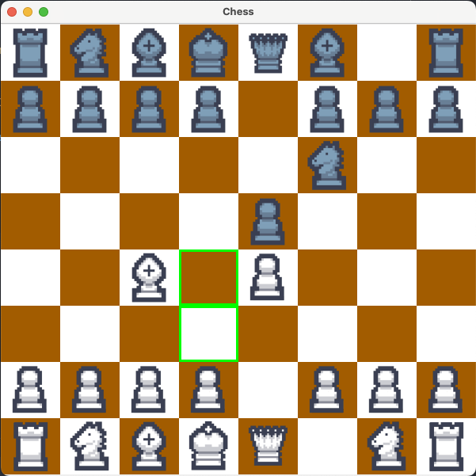

# Digital Chess Game

This project is a fun recreation of the classic chess game. It's built using Java and provides a graphical user interface for playing chess.

## How to Run
1. Clone the repository
2. Open the project in your preferred Java IDE (I'm using IntelliJ IDEA)
3. Run the ChessBoard class to start the game

## To-Do List
- [x] Create Grid
- [x] Create Pieces
- [x] Create Piece Movement
- [x] Add Images to Pieces
- [x] Show where pieces can move
- [x] Add sound effects
- [x] Implement castling
- [x] Add pawn promotion functionality
- [ ] Implement en passant capture
- [ ] Add an option to play against an AI opponent
- [ ] Implement game save and load functionality
- [ ] Add undo and redo move options
- [ ] Improve piece movement animations
- [ ] Create customizable themes for the chessboard
- [ ] Add multiplayer support over a network

## Dependencies
- Java 8 or later
- Java Swing for the GUI

## Contributing
As this is a personal, fun project, contributions are currently not being accepted. However, feel free to fork the repository and make your own modifications.

## License
This project is licensed under the MIT License. See the LICENSE file for details.

## Acknowledgments
- Chess piece images - [Denise Heeffer](https://spheya.artstation.com/projects/QnaVO3)
- Selecting Chess piece sound - [UNIVERSFIELD](https://pixabay.com/sound-effects/click-button-140881/)

## Author
Grant Risk

Enjoy playing chess, and happy coding!
